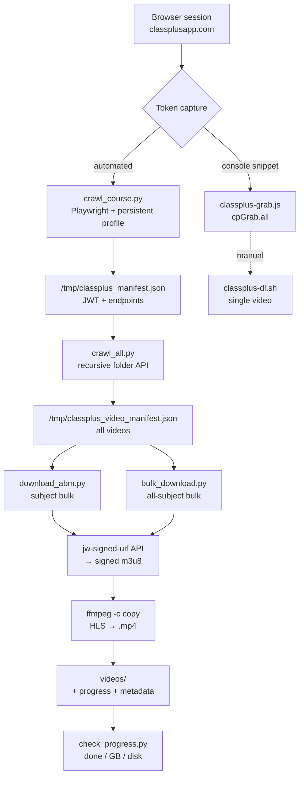

# classplus-video-download-suite


> Extract and bulk-download video content from **Classplus** (`classplusapp.com`) for personal offline viewing of purchased courses.

A five-tool pipeline that captures your session JWT, crawls an entire course tree, resolves signed HLS URLs, and downloads every video to `.mp4` — with SHA-256 checksums, metadata records, resume support, and a disk-space guard.

A valid, **paid** Classplus account is required. The suite does not bypass paywalls or circumvent DRM.

---

## ✨ Features

- **JWT capture** three ways — paste-in browser console, Playwright auto-capture, or manual `DevTools → Network` copy.
- **Recursive crawler** walks every folder of a course and enumerates all videos into a single manifest.
- **Stream-copy downloads** — `ffmpeg -c copy -bsf:a aac_adtstoasc` remuxes HLS → `.mp4` with no re-encode.
- **Bulk + single-video** modes, sharing the same signed-URL resolution path.
- **Resumable** — a JSON progress set lets interrupted runs pick up where they stopped.
- **SHA-256 checksums** and per-video metadata written to both CSV and JSON.
- **Disk-aware** — pauses when free space drops below a configurable floor.
- **Retry with backoff** on transient network errors; halts cleanly on auth errors.

---

## 📦 Installation

**Prerequisites:** Python 3.8+, `ffmpeg`, `curl`, and `tmux` (only if you background long runs).

```bash
# macOS
brew install ffmpeg tmux
```

```bash
# Debian / Ubuntu
sudo apt update && sudo apt install -y ffmpeg curl tmux
```

Install the Python dependencies and the Chromium build Playwright drives:

```bash
pip install requests playwright
playwright install chromium
```

No build step. Clone and go:

```bash
git clone <repo-url> classplus-video-download-suite
cd classplus-video-download-suite
```

---

## 🚀 Usage

The suite mirrors its own pipeline. Run the stages in order, or jump straight to single-video download.

### Capture your auth token

You only need one of these methods. All produce a JWT used by the downloaders.

**Option A — Playwright (automated).** Launches a real Chromium with a persistent profile, so your login survives browser restarts.

```bash
python3 crawl_course.py 696969
```

Log in to `classplusapp.com` and browse the course. The script intercepts every API call and writes the token + discovered endpoints to `/tmp/classplus_manifest.json`. Close the browser — or signal completion:

```bash
touch /tmp/classplus_done
```

**Option B — Browser console snippet.** Open `classplusapp.com`, log in, open DevTools → Console (F12), paste `classplus-grab.js`, and press Enter. Then click any video and run:

```javascript
cpGrab.all();   // → { token, contentId }
cpGrab.help();  // → usage
```

**Option C — Manual.** In DevTools → Network, filter for `jw-signed-url` and copy the `contentId=...` query value plus the request's `x-access-token` header.

### Crawl the whole course

`crawl_all.py` recursively calls the folder-listing API (`/v2/course/content/get`) and collects every video into a manifest.

```bash
python3 crawl_all.py
```

Writes `/tmp/classplus_video_manifest.json` and prints a per-folder video count.

### Download

**Single video** — resolve one signed URL and remux:

```bash
export CLASSPLUS_TOKEN='eyJh...'        # JWT, any API request's x-access-token
./classplus-dl.sh <encrypted-content-id> output-name
```

**One subject in bulk** — `download_abm.py` is the full-featured downloader (checksums, metadata, disk guard, retries):

```bash
tmux new-session -d -s dl "python3 download_abm.py 2>&1 | tee /tmp/abm_download.log"
python3 check_progress.py
tmux attach -t dl
```

`check_progress.py` prints videos done / total, GB downloaded, average MB per video, free disk, and the last five downloads.

**Everything at once** — `bulk_download.py` iterates the full manifest:

```bash
tmux new-session -d -s dl "python3 bulk_download.py 2>&1 | tee /tmp/download.log"
tmux attach -t dl
```

### Output layout

Videos land in the configured output directory, mirroring the course's folder structure:

```
videos/
└── ABM JUNE 2026/
    ├── MODULE WISE LECTURES (A+B+C+D)/
    │   ├── MODULE A: STATISTICS/
    │   │   ├── CH 1 PART I Statistics.mp4
    │   │   └── ...
    │   └── MODULE B: HUMAN RESOURCE MANAGEMENT/
    │       └── ...
    ├── LIVE CLASSES/
    │   └── ...
    └── CASE STUDY & RECALLED QUESTIONS/
        └── ...
```

Each bulk run also writes sidecar state alongside the videos:

| File | Contents |
|---|---|
| `*_progress.json` | Set of completed content IDs — drives resume |
| `*_metadata.json` | Per-video SHA-256, byte size, timestamp |
| `*_metadata.csv` | Same records as CSV |

---

## ⚙️ Configuration

There is no config file; behavior is set by environment variables and constants at the top of each script.

**Environment variable**

| Variable | Used by | Purpose |
|---|---|---|
| `CLASSPLUS_TOKEN` | `classplus-dl.sh` | JWT (`x-access-token`). Prompted interactively if unset. |

**Positional arguments**

| Script | Argument | Default |
|---|---|---|
| `crawl_course.py` | `[course_id]` | `696969` |
| `bulk_download.py` | `[output_dir]` | `~/development/classplus-dl/videos` |

**Hardcoded paths & constants** (edit at the top of each file to repoint)

- `crawl_all.py` — reads `/tmp/classplus_manifest.json`, course ID `696969`, writes `/tmp/classplus_video_manifest.json`, 0.15 s throttle between folder calls.
- `download_abm.py` — manifest `/tmp/classplus_abm_manifest.json`, output `~/development/classplus-dl/videos/ABM JUNE 2026`, `DELAY=3` s, `MIN_FREE_GB=5`, `MAX_RETRIES=3`, `RETRY_BACKOFF=[5, 15, 45]` s.
- `bulk_download.py` — `DELAY_SECONDS=3`, progress at `~/development/classplus-dl/download_progress.json`.
- `check_progress.py` — expects `total = 285` (tune to your course's video count).

**API contract (reverse-engineered)**

```
GET https://api.classplusapp.com/v2/course/content/get?courseId=<id>&folderId=<id>
GET https://api.classplusapp.com/cams/uploader/video/jw-signed-url?contentId=<hash>
Headers:  x-access-token: <JWT>
          region: IN
          Origin:  https://web.classplusapp.com
          Referer: https://web.classplusapp.com/
```

---

## 🧱 Architecture



The capture and crawl stages run once per login session; the download stage is resumable and idempotent — re-running skips videos already in the progress set. See [`AGENTS.md`](AGENTS.md) for the full development guide and [`RESEARCH.md`](RESEARCH.md) for API reverse-engineering notes.

---

## 🤝 Contributing

This is a small, single-author utility. Bug reports and pull requests are welcome. Before contributing, read [`AGENTS.md`](AGENTS.md) for the architecture and conventions, and keep changes consistent with the existing pipeline (capture → crawl → resolve → remux).

---

## ⚠️ Disclaimer

This tool is intended for **personal offline viewing of legally purchased course content**. It does **not**:

- Circumvent DRM (the target videos report `drmProtected: 0`).
- Bypass paywalls (a valid, purchased account is required).
- Enable redistribution of copyrighted material.

Using it may still violate Classplus's Terms of Service. The author assumes no liability for account suspension or other consequences. **Use at your own risk.**

---

> **Note on licensing:** No `LICENSE` file ships with this repository. Treat the code as **all rights reserved** by the author until one is added.
